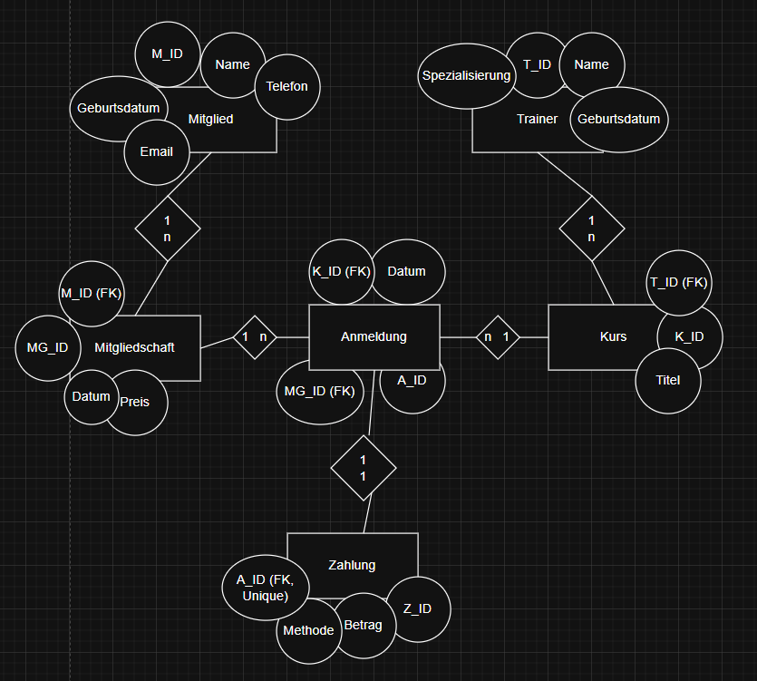

## AUSGANGSTEXT
Das Fitnessstudio verwaltet Mitglieder, Trainer, Kurse, Mitgliedschaften, Anmeldungen und Zahlungen.

Ein Mitglied wird mit MitgliedID, Name, Geburtsdatum, E-Mail und Telefonnummer gespeichert. Ein Mitglied kann mehrere Mitgliedschaften besitzen, beispielsweise unterschiedliche Tarifmodelle. Jede Mitgliedschaft ist eindeutig einem Mitglied zugeordnet und enthält eigene Attribute wie MG_ID, Datum und Preis.

Trainer werden mit TrainerID, Name, Geburtsdatum und Spezialisierung erfasst. Ein Trainer kann mehrere Kurse leiten, jedoch wird jeder Kurs genau einem Trainer zugeordnet.

Ein Kurs besitzt eine KursID, einen Titel und einen Fremdschlüssel auf den Trainer. Ein Kurs kann mehrere Teilnehmer haben.

Die Anmeldung bildet die Verbindung zwischen Mitgliedschaft und Kurs. Sie enthält eine eigene ID (A_ID), das Datum der Anmeldung sowie die Fremdschlüssel MG_ID (Mitgliedschaft) und K_ID (Kurs). Eine Mitgliedschaft kann mehrere Anmeldungen besitzen, ebenso kann ein Kurs mehrere Anmeldungen haben. Jede Anmeldung gehört jedoch genau zu einer Mitgliedschaft und genau zu einem Kurs.

Zu jeder Anmeldung wird genau eine Zahlung erfasst. Die Zahlung enthält eine ZahlungsID (Z_ID), den Betrag, die Methode sowie einen eindeutigen Fremdschlüssel auf die Anmeldung. Dadurch entsteht eine 1:1-Beziehung zwischen Anmeldung und Zahlung. Mehrfachzahlungen oder Teilzahlungen sind nicht vorgesehen.

## ERM

## RM
Relationales Modell (RM)
Mitglied

MitgliedID (PK)

Name

Geburtsdatum

Email

Telefonnummer

Trainer

TrainerID (PK)

Name

Spezialisierung

Email

Kurs

KursID (PK)

Titel

TrainerID (FK → Trainer.TrainerID)

Mitgliedschaft

MitgliedschaftID (PK)

Datum

Preis

MitgliedID (FK → Mitglied.MitgliedID)

Beziehung:
Mitglied (1) —— (n) Mitgliedschaft

Anmeldung

AnmeldungID (PK)

MitgliedID (FK → Mitglied.MitgliedID)

KursID (FK → Kurs.KursID)

Anmeldedatum

Beziehungen:
Mitglied (1) —— (n) Anmeldung
Kurs (1) —— (n) Anmeldung

Zahlung

ZahlungID (PK)

Betrag

Zahlungsmethode

AnmeldungID (FK → Anmeldung.AnmeldungID, UNIQUE)

Beziehung:
Anmeldung (1) —— (1) Zahlung

Kardinalitäten zusammengefasst

Mitglied → Mitgliedschaft (1:n)
Mitglied → Anmeldung (1:n)
Trainer → Kurs (1:n)
Kurs → Anmeldung (1:n)
Anmeldung → Zahlung (1:1)

Tabellenanzahl: 6
Primärschlüssel: definiert
Fremdschlüssel: konsistent
1:1 Beziehung korrekt über UNIQUE-FK umgesetzt

## Datenbank Script
```sql
    PRAGMA foreign_keys = ON;

    -- =========================
    -- Tabelle: Mitglied
    -- =========================
    CREATE TABLE Mitglied (
        MitgliedID INTEGER PRIMARY KEY AUTOINCREMENT,
        Name TEXT NOT NULL,
        Geburtsdatum TEXT NOT NULL,
        Email TEXT NOT NULL,
        Telefonnummer TEXT
    );

    -- =========================
    -- Tabelle: Trainer
    -- =========================
    CREATE TABLE Trainer (
        TrainerID INTEGER PRIMARY KEY AUTOINCREMENT,
        Name TEXT NOT NULL,
        Spezialisierung TEXT NOT NULL,
        Email TEXT NOT NULL
    );

    -- =========================
    -- Tabelle: Kurs
    -- =========================
    CREATE TABLE Kurs (
        KursID INTEGER PRIMARY KEY AUTOINCREMENT,
        Titel TEXT NOT NULL,
        TrainerID INTEGER NOT NULL,
        FOREIGN KEY (TrainerID) REFERENCES Trainer(TrainerID)
    );

    -- =========================
    -- Tabelle: Mitgliedschaft
    -- =========================
    CREATE TABLE Mitgliedschaft (
        MitgliedschaftID INTEGER PRIMARY KEY AUTOINCREMENT,
        Datum TEXT NOT NULL,
        Preis REAL NOT NULL,
        MitgliedID INTEGER NOT NULL,
        FOREIGN KEY (MitgliedID) REFERENCES Mitglied(MitgliedID)
    );

    -- =========================
    -- Tabelle: Anmeldung
    -- =========================
    CREATE TABLE Anmeldung (
        AnmeldungID INTEGER PRIMARY KEY AUTOINCREMENT,
        MitgliedID INTEGER NOT NULL,
        KursID INTEGER NOT NULL,
        Anmeldedatum TEXT NOT NULL,
        FOREIGN KEY (MitgliedID) REFERENCES Mitglied(MitgliedID),
        FOREIGN KEY (KursID) REFERENCES Kurs(KursID)
    );

    -- =========================
    -- Tabelle: Zahlung (1:1 mit Anmeldung)
    -- =========================
    CREATE TABLE Zahlung (
        ZahlungID INTEGER PRIMARY KEY AUTOINCREMENT,
        Betrag REAL NOT NULL,
        Zahlungsmethode TEXT NOT NULL,
        AnmeldungID INTEGER NOT NULL UNIQUE,
        FOREIGN KEY (AnmeldungID) REFERENCES Anmeldung(AnmeldungID)
    );

    -- =========================
    -- Beispiel-Daten
    -- =========================

    -- Mitglieder
    INSERT INTO Mitglied (Name, Geburtsdatum, Email, Telefonnummer) VALUES
    ('Max Mustermann', '2000-05-12', 'max@example.com', '0664123456'),
    ('Anna Berger', '1998-11-03', 'anna@example.com', '0664987654');

    -- Trainer
    INSERT INTO Trainer (Name, Spezialisierung, Email) VALUES
    ('Thomas Huber', 'Krafttraining', 'thomas@fitness.at'),
    ('Lisa Maier', 'Yoga', 'lisa@fitness.at');

    -- Kurse
    INSERT INTO Kurs (Titel, TrainerID) VALUES
    ('Bodybuilding Basics', 1),
    ('Morning Yoga', 2);

    -- Mitgliedschaften
    INSERT INTO Mitgliedschaft (Datum, Preis, MitgliedID) VALUES
    ('2025-01-01', 49.99, 1),
    ('2025-01-01', 39.99, 2);

    -- Anmeldungen
    INSERT INTO Anmeldung (MitgliedID, KursID, Anmeldedatum) VALUES
    (1, 1, '2025-02-01'),
    (2, 2, '2025-02-02');

    -- Zahlungen (1:1 zur Anmeldung)
    INSERT INTO Zahlung (Betrag, Zahlungsmethode, AnmeldungID) VALUES
    (19.99, 'Kreditkarte', 1),
    (14.99, 'Überweisung', 2);
```

## ANVIL Umsetzung
Unterfenster
- Mitgliederform
- Dashboardform
Navigation über Mainform.

Backend-Endpunkte
- get_mitglieder()
- get_kurse()
- get_anmeldungen()
- get_umsatz_pro_kurs()
- get_anzahl_teilnehmer_pro_kurs()

Dashboards
- Umsatz pro Kurs 
- Teilnehmer pro Kurs

## GitHub Link und Publish Link
